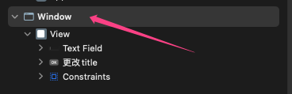
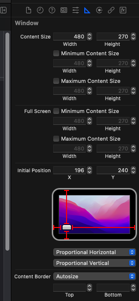

#   NSWindow

1. 改 window.title 
    - 需要window已经加载完成, 在 NSViewController 的生命周期方法中通过 view.window 看是否已经完成了 window 的实例化, 然后再通过 view.window.title 改变title

2. 如果不指定 (withNibName: "") 将会自动寻找包里第一层目录找到的第一个 WindowController 然后实例化 绑定对应的xib

选中Xib中的Window 可以设置出现的位置以及大小

 

